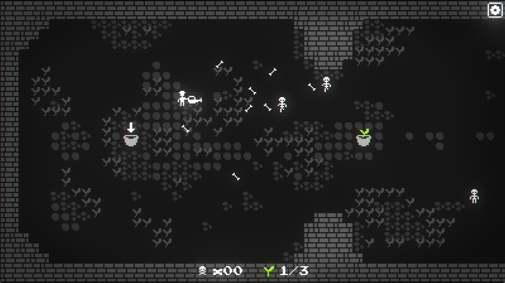

# Skeletons ate my plants

*A game for the [GameDev.tv Game Jam 2022](https://itch.io/jam/gamedevtv-jam-20229).*

**Play it at [itch.io](https://detomon.itch.io/skeletons-ate-my-plants).**

## Story

**Skeletons ate your plants!**

Now you have to destroy them with the help of your trusty watering can and regrow your plants.

## Controls

- Move with `WASD` or  `Arrow Keys`
- Shoot with `Space`, `Shift` or `Mouse`

## Used Tools and Resources

### Game Engine

- [Godot Engine](https://godotengine.org)

### Graphics

- [Aseprite](https://www.aseprite.org)

### Sound

- [bliplay](https://github.com/detomon/bliplay)
- [ffmpeg](https://ffmpeg.org)
- [Sublime Text](https://www.sublimetext.com)

### Fonts

- [PixelInterface](https://github.com/rakkarage/PixelInterface)

## TODOs and Issues

- Minor issue: On the first shot after respawning, the weapon does sometimes not correctly return to player
- Softlock: No end sequence is played when game is paused on last planting animation
